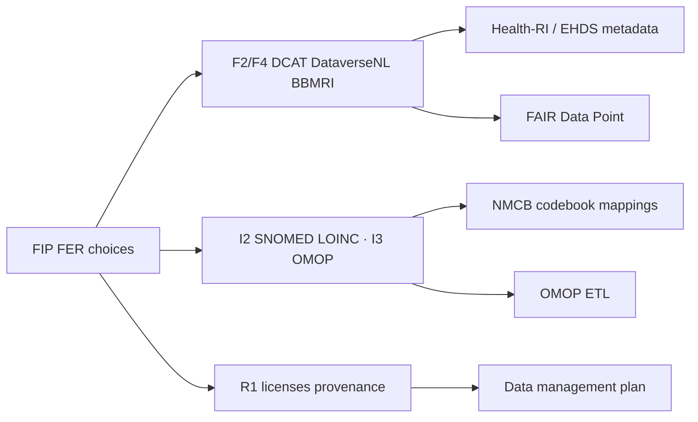

# FAIR Implementation Profile (FIP)

*NMCB’s FIP records **which FAIR Enabling Resources (FERs)** the consortium chose to implement the [FAIR Guiding Principles](https://www.go-fair.org/fair-principles/). It supports alignment with national infrastructure (Health-RI, BBMRI, DataverseNL) and with ontology / OMOP work documented elsewhere in this folder.*

---

## What is a FIP?

A **FAIR Implementation Profile (FIP)** is a **collective declaration** of technology and policy choices—called **FAIR Enabling Resources (FERs)**—that a **community of practice** uses to implement the FAIR principles (Findable, Accessible, Interoperable, Reusable).

| Concept | Meaning |
| -------- | -------- |
| **FAIR principles** | High-level goals (F1–F4, A1–A2, I1–I3, R1.1–R1.2); they do not name specific tools. |
| **FER** | A concrete resource type (e.g. DOI, DCAT, HTTPS, LOINC) linked to one or more principles. |
| **FIC** | FAIR Implementation **Community**—here, the NMCB consortium. |
| **FIP output** | Questionnaire answers, often published as **nanopublications** via the [FIP Wizard](https://fip.fair-wizard.com/). |

**Why communities build FIPs:** to document *as-is* or *to-be* implementations, compare choices across domains (FIP Matrix), and reuse FERs instead of reinventing stacks. Background: [Schultes et al. (2020)](https://link.springer.com/chapter/10.1007/978-3-030-65847-2_13); how-to: [GO FAIR FIP Wizard User Guide](https://wiki.gofair.foundation/docs/fip/content.html).

**NMCB tooling:**

| Tool | Role |
| ------ | ----- |
| **[FIP Wizard project (NMCB)](https://fip.fair-wizard.com/wizard/projects/64607580-dec0-40db-aca0-5151f96b4833)** | Online questionnaire and nanopublication workflow (canonical if you have login). |
| **FIP mini-questionnaire** | Spreadsheet template; NMCB copy in repo (community metadata + principle rows). |
| **NMCB FIP overview** | Workshop summary matrix (Sep 2024): FER selections for **Survey data** vs **Biobank data**. |

---

## NMCB community metadata

From the filled mini-questionnaire (Feb 2024):

| Field | Value |
| ------- | ------- |
| **Community** | The NMCB Consortium |
| **Description** | National collaboration on biomedical research on ME/CFS (Netherlands ME/CFS Cohort and Biobank). |
| **Link** | [https://nmcb.eu/](https://nmcb.eu/) |
| **Research domain** | Medical Psychology |
| **Data steward (ORCID)** | [0000-0003-4715-9070](https://orcid.org/0000-0003-4715-9070) |
| **FIP creation date** | 16 February 2024 |

Contributors noted in internal notes: Shuxin Zhang, Kate, Meriem Manaï, Jos Bosch.

---

## FER selections (summary)

The table below reflects **`NMCB FIP Overview.xlsx`** (updated **September 2024**), which maps FERs to two **digital object types** discussed in the ZonMw FIP workshop:

- **Survey data** — e.g. Castor questionnaires, processed/stored in SQL pipelines.
- **Biobank data** — samples and related records (BBMRI-ERIC context).

Where a cell is empty, that FER was **not** marked for that object type in the overview. **“No choice”** means the team explicitly left the decision open (common for sensitive clinical data and licenses).

### Findability (F)

| Principle | FER | Survey data | Biobank data |
| ----------- | ----- | :-----------: | :------------: |
| **F1** (metadata IDs) | DOI | ✓ | |
| | PURL | ✓ | ✓ |
| | Identifiers.org | ✓ | |
| **F1** (dataset IDs) | DOI | ✓ | |
| | PURL | ✓ | ✓ |
| | Identifiers.org | ✓ | |
| **F2** (metadata schema) | DCAT | ✓ | ✓ |
| **F3** (metadata–data link) | Linked Open Data (LOD) | ✓ | |
| **F4** (search / registry) | DataverseNL | ✓ | |
| | BBMRI | | ✓ |

**Interpretation:** Survey metadata is oriented toward **catalogue findability** (DataverseNL, DCAT, LOD). Biobank findability leans on **BBMRI-ERIC** infrastructure.

### Accessibility (A)

| Principle | FER | Survey data | Biobank data |
| ----------- | ----- | :-----------: | :------------: |
| **A1.1** (protocol, MD & data) | HTTPS | ✓ | ✓ |
| **A1.2** (auth, metadata) | Open Data | ✓ | |
| **A1.2** (auth, datasets) | *No choice* | ✓ | |
| **A2** (metadata longevity) | Dataverse preservation plan | ✓ | |

**Interpretation:** Open, protocol-level access for **metadata**; **dataset** access controls are **undecided** in the FIP (fits controlled-access cohort data). Longevity for survey metadata ties to **DataverseNL**.

### Interoperability (I)

| Principle | FER | Survey data | Biobank data |
| ----------- | ----- | :-----------: | :------------: |
| **I1** (knowledge representation, MD) | Turtle | ✓ | |
| | CSV | ✓ | ✓ |
| | JSON | ✓ | |
| **I1** (datasets) | Turtle | ✓ | |
| | CSV | ✓ | ✓ |
| | JSON | ✓ | |
| **I2** (vocabularies, MD) | DCAT | ✓ | |
| **I2** (vocabularies, data) | SNOMED CT | ✓ | ✓ |
| | LOINC | ✓ | ✓ |
| **I3** (schema, MD) | DCAT | ✓ | |
| **I3** (schema, data) | Own data model | ✓ | |
| | OMOP CDM | ✓ | |
| | *No choice* | | ✓ |

**Interpretation:** Strong overlap with NMCB [ontology harmonization](ontology-harmonization.md) (SNOMED, LOINC) and [OMOP mapping](omop-mapping.md). Survey pipelines: **DCAT** + **OMOP** + cohort **own model**; biobank **data schema** still **open**.

### Reusability (R)

| Principle | FER | Survey data | Biobank data |
| ----------- | ----- | :-----------: | :------------: |
| **R1.1** (license, metadata) | CC BY-NC 4.0 | ✓ | |
| **R1.1** (license, datasets) | *No choice* | ✓ | ✓ |
| **R1.2** (provenance, metadata) | *No choice* | ✓ | ✓ |
| **R1.2** (provenance, datasets) | PROV | ✓ | |
| | DCAT | ✓ | |
| | Dublin Core | ✓ | |
| | *No choice* | | ✓ |

**Interpretation:** **CC BY-NC 4.0** for shareable **metadata**; **dataset licenses** and biobank **provenance models** remain to be fixed with legal/DMP review.

---

## How this connects to other NMCB FAIR work

| FIP area | Related handover page |
| -------- | --------------------- |
| DCAT, catalogues | [Health-RI metadata](health-ri-metadata.md), [DMP](../tasks/data-management-plan.md) |
| FDP / RDF metadata | [FAIR Data Point](fair-data-point.md) |
| SNOMED, LOINC, OMOP | [Controlled vocabulary](controlled-vocabulary.md), [OMOP mapping](omop-mapping.md) |
| National metadata alignment | [PAIS metadata schema](pais-metadata-schema.md) |

---

## Attachments in this repo

| File | Description |
| ------ | ------------- |
| [nmcb-fip-overview.xlsx](../files/fair/fip/nmcb-fip-overview.xlsx) | Sep 2024 matrix (Survey vs Biobank) — source for the table above |
| [fip-mini-questionnaire-nmcb.xlsx](../files/fair/fip/fip-mini-questionnaire-nmcb.xlsx) | Community fields + principle questionnaire rows |
| [fip-documentation.docx](../files/fair/fip/fip-documentation.docx) | Short internal intro (why FIP, links to mini-questionnaire and Wizard) |

Additional workshop material (digital object types, ZonMw sessions) lives on Research Drive / `Documents/NMCB/ZonMw/FIP/`; not all files are mirrored here.

---

## Handover checklist

1. **Open the [Wizard project](https://fip.fair-wizard.com/wizard/projects/64607580-dec0-40db-aca0-5151f96b4833)** — confirm answers match the overview xlsx after any infrastructure change (Snowflake, myDRE, Health-RI onboarding).
2. **Resolve “No choice” rows** — especially A1.2 (dataset access), R1.1 (dataset license), R1.2 (biobank provenance), I3 (biobank schema).
3. **Publish the FIP** when ready ([publishing steps](https://wiki.gofair.foundation/docs/fip/content.html)) so FERs become citable nanopublications.
4. **Keep FIP, DMP, and codebook aligned** — when OMOP or catalogue targets change, update both the FIP and [data management plan](../tasks/data-management-plan.md).

---

## References

- [FIP Wizard — NMCB project](https://fip.fair-wizard.com/wizard/projects/64607580-dec0-40db-aca0-5151f96b4833)
- [GO FAIR — FIP Wizard User Guide](https://wiki.gofair.foundation/docs/fip/content.html)
- [FIP mini-questionnaire template (Google Sheet)](https://docs.google.com/spreadsheets/d/1tDIRW-_W-bxaFyhc18Z_0VLE45j8XnF7Ll_hW7FP2xM/edit#gid=127295437)
- [FAIR Principles](https://www.go-fair.org/fair-principles/)
