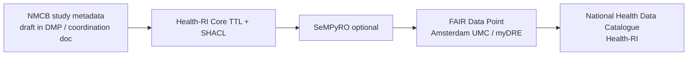

# Health-RI core metadata schema

*The **[Health-RI Core metadata schema](https://github.com/Health-RI/health-ri-metadata)** powers the **National Health Data Catalogue** and aligns with the **European Health Data Space (EHDS)** via **HealthDCAT-AP**.*

NMCB has not completed onboarding to this schema; documented here for when catalogue work resumes (no active follow-up on the NMCB side).

---

## Repository

| Item | Link |
| ---- | ---- |
| **GitHub** | [Health-RI/health-ri-metadata](https://github.com/Health-RI/health-ri-metadata) |
| **Latest release** | [v2.0.2](https://github.com/Health-RI/health-ri-metadata/releases) (Oct 2025) |
| **Documentation** | Class/property reference on the repo **documentation** site (linked from README) |
| **SHACL shapes (Core)** | [Formalisation(shacl)/Core](https://github.com/Health-RI/health-ri-metadata/tree/develop/Formalisation%28shacl%29/Core) — TTL configuration for metadata schemas and resource definitions |
| **Excel overview** | All classes and properties — file linked from repo README |
| **Onboarding wiki** | Metadata mapping tutorials (linked from README) |

License: **CC-BY-4.0**.

---

## Why it matters for NMCB

From [PAIS coordination](pais-metadata-schema.md) and DMP phase 4–5:

- UMCs will increasingly report **study metadata** for EHDS / Health-RI catalogue
- Health-RI harvests from **FAIR Data Points** and other sources (e.g. Dataverse)
- NMCB today: strong **variable-level** [codebook](https://github.com/nmcb-fair/nmcb-codebook); weak **study-level** catalogue record
- Aligning NMCB study description to Health-RI Core reduces duplicate forms and supports findability (PIDs, ACH, DataverseNL — see [DMP](../tasks/data-management-plan.md))

---

## Technical stack (high level)

- **SHACL** validates RDF metadata against the Core model  
- **TTL files** in `Formalisation(shacl)/Core` define constraints and resource definitions  
- **SeMPyRO** can help generate or publish FDP-compatible metadata ([example notebook](https://github.com/Health-RI/SeMPyRO/blob/main/docs/Usage_example_FDP.ipynb))

---

## Onboarding

- General questions and data-holder onboarding: [onboarding@health-ri.nl](mailto:onboarding@health-ri.nl)
- RDM consultant for NMCB DMP: Meriem Manaï — [m.manai@amsterdamumc.nl](mailto:m.manai@amsterdamumc.nl)

---

## Handover checklist

- [ ] Read Core schema Excel / docs for mandatory study-level fields
- [ ] Compare with [PAIS coordination doc](../files/fair/pais-metadata/metadata-schema-coordination-april-2026.docx) NMCB section
- [ ] Decide pilot: metadata-only record vs full FDP resource for one sub-project
- [ ] Track Health-RI release version used (pin to v2.0.2 or newer on `develop`)

---

## Related

- [FAIR overview](index.md)
- [PAIS metadata schema](pais-metadata-schema.md)
- [FAIR Data Point](fair-data-point.md)
- [Data management plan](../tasks/data-management-plan.md)
