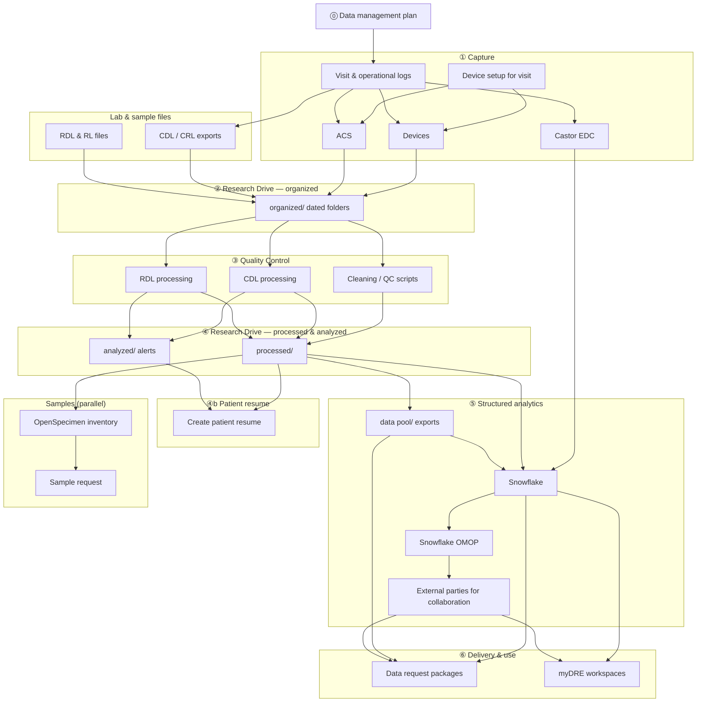

# NMCB hand-over documentation

Welcome to the working hand-over for the **Netherlands ME/CFS Cohort and Biobank (NMCB)** data management and data infrastructure role.

For folder paths see [Where data lives](where-data-lives.md). For step-by-step procedures see [Workflows](workflows/index.md).

---

## End-to-end data flow

The diagram starts with the **data management plan**, then runs from **capture** through **Research Drive** and **Snowflake** (Castor loads **directly** into Snowflake). **Patient resume** is built from processed and analyzed outputs; **Snowflake (OMOP)** feeds external collaboration. The **samples** branch ends with **sample request** after OpenSpecimen. **Click a box** in the diagram (desktop) or use the [step reference table](#step-reference-clickable-links).

**Versioning:** keep raw data under `organized/`; each cleaning or merge produces a **new** `processed/` (or `analyzed/`) output — do not overwrite the only raw copy ([Research Drive](systems/research-drive.md#data-journey-document-this-over-time)).

### Step reference (clickable links)

| Step                                   | What happens                                                                      | Documentation                                                                                                                              |
| -------------------------------------- | --------------------------------------------------------------------------------- | ------------------------------------------------------------------------------------------------------------------------------------------ |
| **⓪ Data management plan**             | Study-wide storage, ethics, Castor, devices, catalogues (main + sub-project DMPs) | [Data management plan](tasks/data-management-plan.md)                                                                                      |
| **① Visit & logs**                     | Scheduling, visit log, subject ID log, mailbox routines                           | [Recurring study routines](workflows/recurring-routines.md) · [Where data lives](where-data-lives.md)                                      |
| **Castor EDC**                         | eCRF and surveys — loads **directly to Snowflake** (no QC step)                   | [Castor](systems/castor.md) · [Snowflake](systems/snowflake.md)                                                                            |
| **Device setup**                       | iPad / laptop ready before measurements                                           | [Device setup for visit](workflows/device-setup-for-visit.md)                                                                              |
| **Devices**                            | VU-AMS, Omron, Nellcor, Tanita, …                                                 | [Devices](systems/devices.md) · [Device data workflow](workflows/device-data-workflow.md)                                                  |
| **ACS**                                | Amsterdam Cognitive Scan (parallel to other devices)                              | [ACS data clean](tasks/acs-data-clean.md) · [Devices — ACS](systems/devices.md#amsterdam-cognitive-scan)                                   |
| **CDL / CRL**                          | Central lab raw files → per-participant outputs & alerts                          | [CDL alert workflow](workflows/cdl-alert-workflow.md)                                                                                      |
| **RDL / RL**                           | Radboud lab + blood-tube / box files                                              | [RDL alert workflow](workflows/rdl-alert-workflow.md) · [Multi-centre sample data workflow](workflows/multicentre-sample-data-workflow.md) |
| **② `organized/`**                     | Raw drops on Research Drive (`organized/CDL/`, `organized/{device}/`, …)          | [Research Drive](systems/research-drive.md) · [Where data lives](where-data-lives.md)                                                      |
| **③ Quality Control**                  | Python/R cleaning, validation; CDL/RDL processing workflows                       | [GitHub](systems/github.md) · [CDL](workflows/cdl-alert-workflow.md) · [RDL](workflows/rdl-alert-workflow.md)                              |
| **④ `processed/` & `analyzed/`**       | Analysis-ready tables; CDL/RDL alert folders for clinicians                       | [Where data lives](where-data-lives.md)                                                                                                    |
| **④b Patient resume**                  | Per-participant Excel summary from **processed** + **analyzed** inputs            | [Patient resume](tasks/patient-resume.md)                                                                                                  |
| **⑤ `data pool/`**                     | Device/lab exports for package builds (Castor via Snowflake)                      | [Data request](tasks/data-request.md)                                                                                                      |
| **⑤ Snowflake**                        | Structured cohort tables (incl. Castor), eligibility, reporting                   | [Snowflake](systems/snowflake.md)                                                                                                          |
| **⑤ Snowflake (OMOP)**                 | OMOP CDM mappings and ETL on Snowflake data                                       | [OMOP CDM mapping](fair/omop-mapping.md)                                                                                                   |
| **External parties for collaboration** | Approved data sharing with researchers / collaborators                            | [Data request](tasks/data-request.md) · [myDRE](systems/mydre.md)                                                                          |
| **⑥ Data request**                     | Approved CSV packages for researchers                                             | [Data request](tasks/data-request.md) · [GDPR rules](#keep-in-mind-gdpr-and-data-sharing)                                                  |
| **⑥ myDRE**                            | Controlled analysis environment for approved subsets                              | [myDRE](systems/mydre.md)                                                                                                                  |
| **OpenSpecimen**                       | Physical sample metadata & inventory (from biobank path)                          | [Biobank](systems/biobank.md) · [OpenSpecimen](systems/openspecimen.md)                                                                    |
| **Sample request**                     | Select aliquots, pseudonymized release files for approved sample requests         | [Biosample request workflow](workflows/sample-request-workflow.md) · [automation](tasks/sample-request.md)                                 |

---

## Overview

NMCB data currently spans:

- study capture in [Castor](systems/castor.md) → [Snowflake](systems/snowflake.md) (direct)
- operational logs — [Recurring study routines](workflows/recurring-routines.md)
- devices and [ACS](tasks/acs-data-clean.md) — [Devices](systems/devices.md), [Device data workflow](workflows/device-data-workflow.md)
- [Patient resume](tasks/patient-resume.md) from processed + analyzed outputs
- [OMOP](fair/omop-mapping.md) on Snowflake for external collaboration
- labs (CDL, RDL, RL) — [workflows](workflows/index.md)
- files on [Research Drive](systems/research-drive.md); sensitive data on YoDa when required
- analytics in [Snowflake](systems/snowflake.md)
- sharing via [Data request](tasks/data-request.md) and [myDRE](systems/mydre.md)
- samples in [OpenSpecimen](systems/openspecimen.md) → [Biosample request workflow](workflows/sample-request-workflow.md) · [Sample request scripts](tasks/sample-request.md)
- governance in [Data management plan](tasks/data-management-plan.md)

## Architecture principle

Identifiers and provenance should survive every transformation step. Every workflow should make it possible to answer: where did this record originate; which process changed it; which ID links it to the participant; is the dataset raw, intermediate, or analysis-ready?

---

## Keep in mind (GDPR and data sharing)

These rules apply to **every** export, list, myDRE delivery, or biobank hand-off. Source: Amsterdam UMC RDM (Paulo Heemskerk, myDRE / data-request discussions, Aug 2025).

### Minimize what you share

- Share **only variables and participants that the request actually needs** — no “nice to have” columns, no wider cohort than necessary.
- Prefer the **least identifying** form of a variable (e.g. share **age**, not **date of birth**, when age is enough for matching or analysis).
- Do **not** send screener or cohort **answers for all participants** so requestors can browse and pick subjects. Requestors must provide **selection criteria in advance**; you return data **only for participants who meet those criteria**.
- Sharing the **list of questions / data dictionary** (what was collected, not the answers) is fine; sharing multi-participant answer sets for pre-selection is **not**.

### Identifiers

- Use **participant / Castor study ID** in NMCB workflows — not **hospital patient ID** (highly sensitive). There is **no** default ethics/privacy approval to share patient IDs; do not include them unless explicitly approved for that request.
- When Jos or others say “patient ID”, they usually mean **Castor participant ID** — confirm before exporting.

### Before you send anything

1. Is each field **required** for the stated purpose?
2. Is the extract limited to **relevant participants** (documented selection criteria)?
3. Could any column be replaced by a **less sensitive** alternative (age vs DOB)?
4. Is delivery via an **approved channel** ([myDRE](systems/mydre.md), controlled folder, etc.)?

**RDM contact:** Paulo Heemskerk — [p.f.heemskerk@amsterdamumc.nl](mailto:p.f.heemskerk@amsterdamumc.nl). Operational tooling: [Data request](tasks/data-request.md).

---

## How this site is organised

| Section              | Purpose                                                                                                                                          |
| -------------------- | ------------------------------------------------------------------------------------------------------------------------------------------------ |
| **Where data lives** | Paths on Research Drive, Castor, OpenSpecimen, …                                                                                                 |
| **Workflows**        | CDL/RDL alerts, multicentre samples, devices, recurring routines                                                                                 |
| **Systems**          | Castor, devices, Snowflake, Research Drive, biobank, myDRE, [NMCB Core list](systems/distributed-list.md), GitHub                                |
| **Tasks**            | Data request, sample request, [Withdrawal SOP](tasks/sop-withdrawal.md), [Device data transfer SOP](tasks/sop-data-transfer.md), DMP, ChatGPT, … |
| **FAIR**             | Metadata, FIP, OMOP — [overview](fair/index.md) (handover context; no active follow-up)                                                          |

## How to use this documentation

Use the **diagram above**, then [Where data lives](where-data-lives.md) and the **workflow** or **system** page for the task at hand. **Tasks** hold runnable procedures (data packages, sample requests, tooling).

Each task page should answer: why it exists; when to do it; where; steps; what to check before done.

---

## FAIR and catalogue metadata (future)

Study-level metadata, Health-RI, and FAIR Data Point pilots are **not** in day-to-day operations. See [FAIR projects](fair/index.md). **Controlled vocabulary:** [Ontology harmonization](fair/ontology-harmonization.md), [OMOP mapping](fair/omop-mapping.md) in [nmcb-codebook](https://github.com/nmcb-fair/nmcb-codebook).