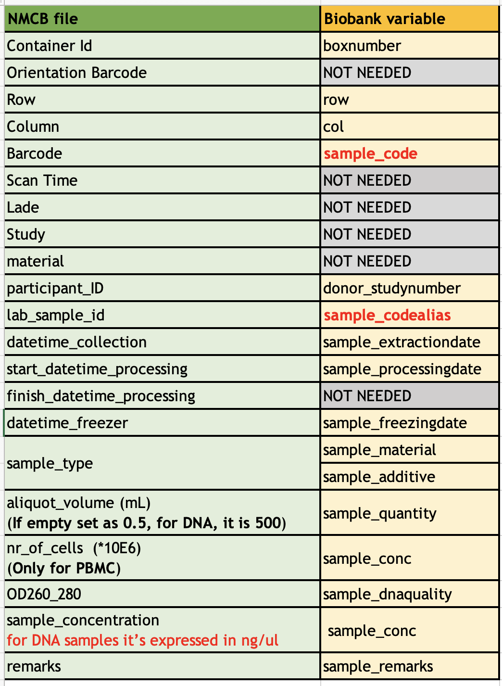
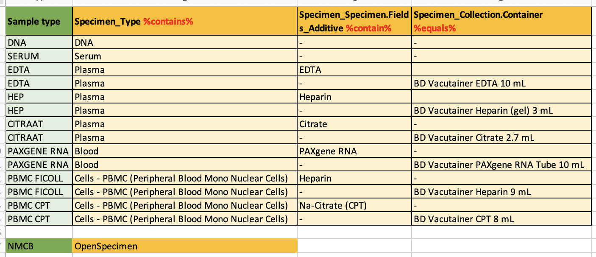
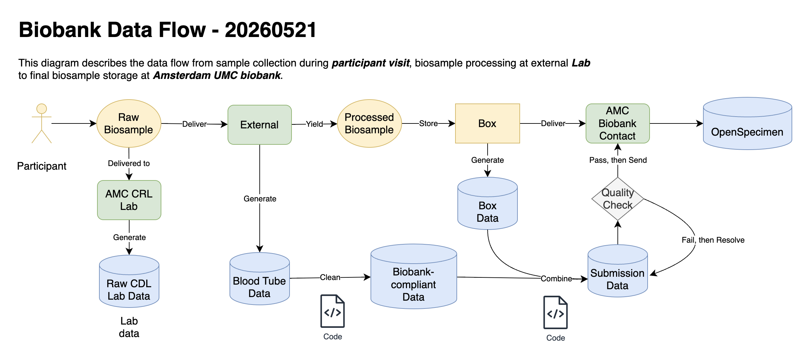

# Biobank data

**Status:** Complete

*Role in NMCB: sample metadata, storage location, and hand-off between labs, Research Drive, OpenSpecimen, and sample requests.*

For each aliquot, biobank-related data should answer:

1. **Where** is it stored? (container, box, row, column)
2. **What** is it? (sample type, concentration, and related metadata)

Inventory and release requests are tracked in [OpenSpecimen](openspecimen.md). Operational steps for Radboud processing, box files, and submission are in [Multi-centre sample data workflow](../workflows/multicentre-sample-data-workflow.md).

## Systems and storage

| System / location | Use |
| ----------------- | --- |
| [OpenSpecimen](openspecimen.md) | Authoritative sample inventory and request tracking |
| Amsterdam UMC biobank | Physical storage; receives validated submission files |
| Research Drive (`Radboud/processed/Biobank/`, etc.) | Box data files, submission files, and processing outputs — see [Research Drive](research-drive.md) |

## Data sources

### Amsterdam UMC (internal lab)

Samples are processed by the internal lab and delivered to the biobank. Records are created from that in-house process.

### Radboud and multi-centre (external lab)

Samples are tracked in the template `Data lab NMCB  - Blood tubes file.xlsm`. Field names and values differ from the biobank database, so NMCB maintains explicit **variable** and **sample type** mappings before submission.

Use the codebook and mapping figures below when building or validating biobank submission files.

## Reference files

| File | Description |
| ---- | ----------- |
| [NMCB biobank mappings v1](../files/biobank/nmcb-biobank-mappings-variables.xlsx) | Variable definitions and mapping rules |
| [Understand OpenSpecimen](../files/biobank/Understnd%20OS.xlsx) | OpenSpecimen fields and how they relate to NMCB |
| [NMCB Blood Label](../files/cdl-alert-workflow/NMCB%20Blood%20Label.xlsx) | Blood tube index: ID, cap colour, sample type |

## External lab → biobank mappings

<!-- Keep the  lines below; without them only the figure caption text appears on the site. -->

### Variables

Map fields from the external-lab template to biobank variables:

*Figure: variable mappings (external lab → biobank).*

### Sample types

Map external-lab sample type labels to biobank sample types:

*Figure: sample type mappings (external lab → biobank).*

## Biobank data flow

End-to-end path from collection through storage and requests (internal and external):

*Figure: biobank data flow.*

| File | Description |
| ---- | ----------- |
| [Biobank data flow (draw.io)](../files/biobank/biobank%20data%20flow.drawio) | Editable source for the workflow diagram |

**Radboud / multi-centre detail:** RL file processing, [box file naming](../workflows/multicentre-sample-data-workflow.md#how-to-rename-box-data-files), expansion into a **Biobank Submission File**, validation, and FileSender delivery — see [Multi-centre sample data workflow](../workflows/multicentre-sample-data-workflow.md).

**Sample requests:** selection and pseudonymized exports — see [Sample request workflow](../workflows/sample-request-workflow.md).

## Blood tube labels (NMCB)

Index of blood tubes used at visit: cap colour and sample type. Full reference: [NMCB Blood Label](../files/cdl-alert-workflow/NMCB%20Blood%20Label.xlsx).

| ID | Color | Type |
| -- | ----- | ---- |
| 1 | Purple small | EDTA for DNA |
| 2 | Red | Serum |
| 3 | Purple large | EDTA Plasma 01 |
| 4 | Green | PBMC Na-Heparin |
| 5 | Green | PBMC Na-Heparin |
| 6 | Green | PBMC Na-Heparin |
| 7 | Green | Heparin Plasma |
| 8 | Purple large | EDTA Plasma 02 |
| 9 | Blue | Citrate 01 |
| 10 | Blue | Citrate 02 |
| — | PAXGene Eigen Sticker | PAXGene RNA 01 |
| — | PAXGene Eigen Sticker | PAXGene RNA 02 |
| 11 | Camouflage | PBMC CPT 01 |
| 12 | Camouflage | PBMC CPT 02 |

*Figure: NMCB Blood Label.*

## Contacts (Amsterdam UMC biobank)

| Role | Contact |
| ---- | ------- |
| General | [biobank@amsterdamumc.nl](mailto:biobank@amsterdamumc.nl) |
| Maureen | [m.e.s.vanderarend@amsterdamumc.nl](mailto:m.e.s.vanderarend@amsterdamumc.nl) |
| Erik van Iperen | [e.p.vaniperen@amsterdamumc.nl](mailto:e.p.vaniperen@amsterdamumc.nl) — can grant **OpenSpecimen** access |

## Related

- [OpenSpecimen](openspecimen.md) — sample tracking system
- [CDL alert workflow](../workflows/cdl-alert-workflow.md) — CRL / CDL lab results (blood label xlsx stored with CDL files)
- [Multi-centre sample data workflow](../workflows/multicentre-sample-data-workflow.md) — RL file, boxing, submission
- [Sample request workflow](../workflows/sample-request-workflow.md) — requesting samples from the biobank
- [Research Drive](research-drive.md) — shared storage layout
