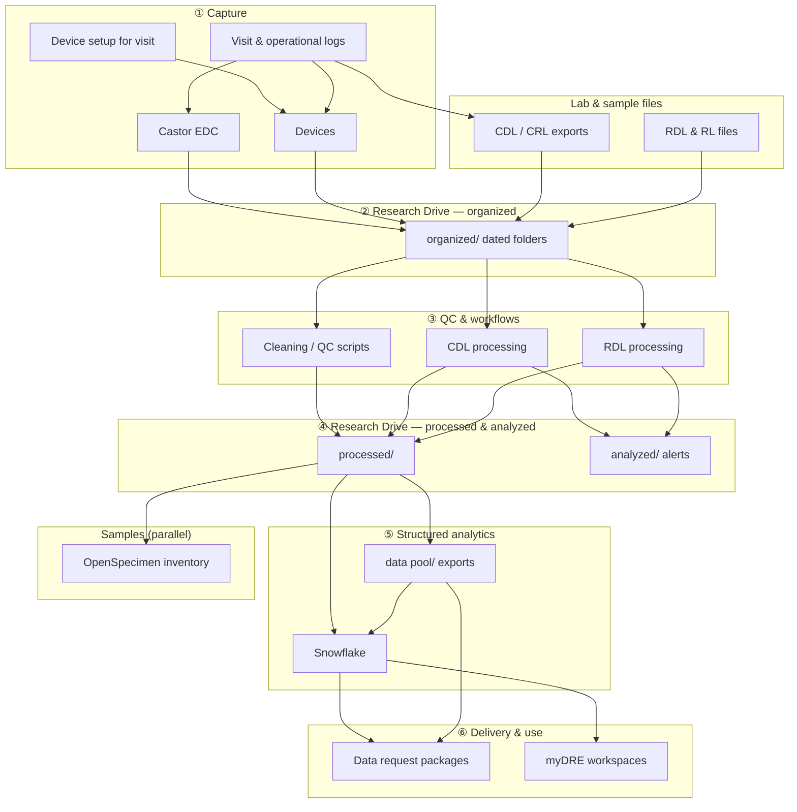

# Data architecture

This page provides a systems-level overview. For procedures, see [Workflows](../workflows/index.md). For folder paths, see [Where data lives](../where-data-lives.md).

## Overview

NMCB data currently spans several operational and analytical domains:

- study capture and study logic in [Castor](castor.md)
- participant and visit tracking in operational logs — [Recurring study routines](../workflows/recurring-routines.md)
- device outputs requiring cleaning or quality control — [Devices](devices.md), [Device data workflow](../workflows/device-data-workflow.md)
- lab exports (CDL, RDL, RL) — [CDL](../workflows/cdl-alert-workflow.md), [RDL](../workflows/rdl-alert-workflow.md), and [multi-centre sample](../workflows/multicentre-sample-data-workflow.md) workflows
- file storage and versioning on [Research Drive](research-drive.md)
- structured analytics in [Snowflake](snowflake.md)
- approved sharing via [Data request](../tasks/data-request.md) and [myDRE](mydre.md)
- sample inventory in [OpenSpecimen](openspecimen.md) (parallel to most tabular Snowflake loads)

---

## End-to-end data flow

The diagram below runs from **capture at the visit** through **Research Drive** stages to **Snowflake**, with delivery to requestors. **Click a box** in the diagram (desktop) or use the [step reference table](#step-reference-clickable-links) — every step links to the relevant workflow or system page.

**Versioning:** keep raw data under `organized/`; each cleaning or merge produces a **new** `processed/` (or `analyzed/`) output — do not overwrite the only raw copy ([Research Drive](research-drive.md#data-journey-document-this-over-time)).

### Step reference (clickable links)

| Step | What happens | Documentation |
| ---- | ------------ | ------------- |
| **① Visit & logs** | Scheduling, visit log, subject ID log, mailbox routines | [Recurring study routines](../workflows/recurring-routines.md) · [Where data lives](../where-data-lives.md) |
| **Castor EDC** | eCRF and surveys during / after visit | [Castor](castor.md) |
| **Device setup** | iPad / laptop ready before measurements | [Device setup for visit](../workflows/device-setup-for-visit.md) |
| **Devices** | VU-AMS, Omron, Nellcor, Tanita, ACS, … | [Devices](devices.md) · [Device data workflow](../workflows/device-data-workflow.md) |
| **CDL / CRL** | Central lab raw files → per-participant outputs & alerts | [CDL alert workflow](../workflows/cdl-alert-workflow.md) |
| **RDL / RL** | Radboud lab + blood-tube / box files | [RDL alert workflow](../workflows/rdl-alert-workflow.md) · [Multi-centre sample data workflow](../workflows/multicentre-sample-data-workflow.md) |
| **② `organized/`** | Raw drops on Research Drive (`organized/CDL/`, `organized/{device}/`, …) | [Research Drive](research-drive.md) · [Where data lives](../where-data-lives.md) |
| **③ QC & scripts** | Python/R cleaning, validation, device conversion | [GitHub](github.md) (`nmcb-fair` repos) |
| **④ `processed/` & `analyzed/`** | Analysis-ready tables; CDL/RDL alert folders for clinicians | [Where data lives](../where-data-lives.md) |
| **⑤ `data pool/`** | Latest Castor + device exports for package builds | [Data request](../tasks/data-request.md) |
| **⑤ Snowflake** | Structured cohort tables, eligibility, reporting | [Snowflake](snowflake.md) |
| **⑥ Data request** | Approved CSV packages for researchers | [Data request](../tasks/data-request.md) · [GDPR rules](../index.md#keep-in-mind-gdpr-and-data-sharing) |
| **⑥ myDRE** | Controlled analysis environment for approved subsets | [myDRE](mydre.md) |
| **OpenSpecimen** | Physical sample metadata & release (from biobank path) | [Biobank](biobank.md) · [OpenSpecimen](openspecimen.md) |

---

## Architecture principle

The most important technical rule is that identifiers and provenance should survive every transformation step.

That means every workflow should make it possible to answer:

- where did this record originate?
- which script or process changed it?
- which identifier links it back to the participant or visit?
- is the current dataset raw, intermediate, or analysis-ready?

---

## Current infrastructure topics reflected in the board

The task board shows active work on:

- refining this pipeline diagram and Research Drive folder layout
- testing SQL setup and Snowflake connectivity
- standardising conversion code for device-derived data
- improving extraction flow by combining patient-centric and source-centric approaches
- exploring automated eligibility logic in Snowflake
- mapping NMCB data toward OMOP

This suggests the infrastructure is still evolving and should be documented as a living system rather than a finished platform.

---

## FAIR and catalogue metadata (future)

Study-level metadata, Health-RI catalogue alignment, and FAIR Data Point pilots are **not** in day-to-day operations yet. See [FAIR projects](../fair/index.md) (PAIS coordination, Amsterdam UMC FDP, [Health-RI core schema](https://github.com/Health-RI/health-ri-metadata)).

**Controlled vocabulary (in progress, no active follow-up):** [Ontology harmonization](../fair/ontology-harmonization.md) (SNOMED CT, LOINC, NCIT; [IOS Press paper](https://ebooks.iospress.nl/doi/10.3233/SHTI260692)) and [OMOP CDM mapping](../fair/omop-mapping.md) in [nmcb-codebook](https://github.com/nmcb-fair/nmcb-codebook).
