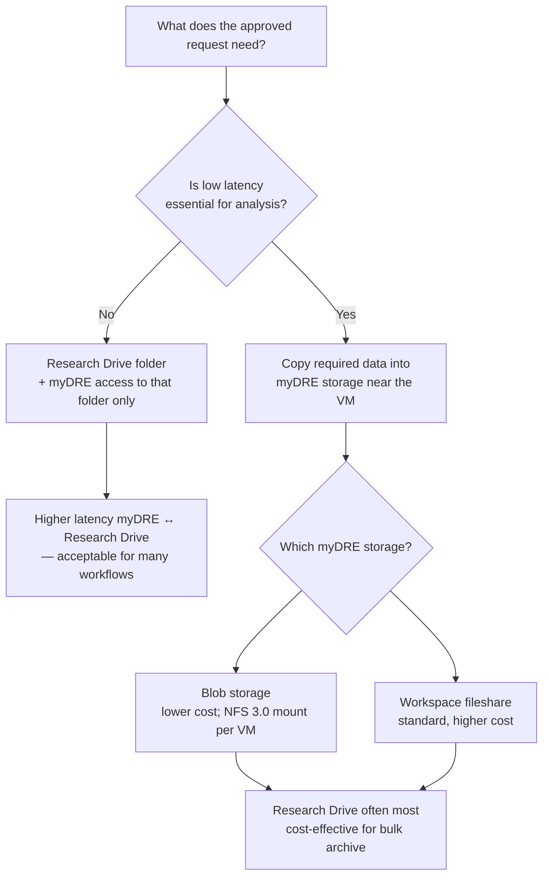

# myDRE

**Status:** Ongoing

*Role: secure analysis environment for sharing sensitive NMCB data with approved researchers without broad file export.*

myDRE (Amsterdam UMC–approved cloud environment) supports **controlled access** and **in-environment analysis**. It is **not** a replacement for [Research Drive](research-drive.md) as the primary long-term store for NMCB study data.

**Tabular packages:** [Data request](../tasks/data-request.md)

---

## Purpose in NMCB

| Use case | Typical approach |
| -------- | ---------------- |
| **Clinical / tabular data** (Castor, devices, questionnaires) | Build pseudonymized packages on Research Drive; deliver via myDRE workspace and/or approved transfer — see [Data request](../tasks/data-request.md) |
| **MRI and large imaging** | Long-term storage on **Research Drive**; **selected** images or subsets may be issued in myDRE for approved requests — full corpus storage in myDRE is **not** required |
| **Multi-centre imaging upload** (Amsterdam, Leiden, Nijmegen) | Sites upload into agreed myDRE partitions; combined analysis inside myDRE (setup with RDM) |

Clarification (Feb 2026, RDM): myDRE can host **only the data that are requested/approved** (e.g. specific MRI series), similar to issuing a subset — not mandatory to mirror all MRI volumes in myDRE.

---

## Choosing a storage and access pattern

**Rule from Research Data Management (RDM):** the “best” solution is **per use case**. Decide from requirements first — especially whether **low latency** between compute and data is essential.



### Option comparison

| Pattern | When it fits | Pros | Cons |
| ------- | ------------ | ---- | ---- |
| **Research Drive + restricted folder + myDRE connection** | Default for many data requests; tabular packages; shared read-only analysis | Long-term home for NMCB data; folder-level access control; no need to duplicate full archives in myDRE | **Higher latency** between myDRE and Research Drive; not ideal for heavy random I/O on huge imaging stacks |
| **Copy subset into myDRE (fileshare)** | Approved MRI (or other large) subset; interactive analysis needs fast local I/O | Low latency inside workspace | Storage cost higher than blob; duplicate copy to maintain |
| **Copy subset into myDRE (blob storage)** | Large imaging / omics-scale data in active analysis | Much **lower storage cost** than standard fileshare (order of magnitude per PI discussions); **NFS 3.0** to Azure Blob works like a fileshare after one-time mount per VM | Mount setup per VM; implementation coordination with AUMC RDM; not always “best fit” vs Research Drive for every workload |
| **Research Drive only (no myDRE)** | Low-sensitivity extracts; file transfer already approved | Simplest | Not for highly sensitive in-environment-only rules |

**RDM notes (Paulo Heemskerk, 2026):**

- You can **restrict access to a specific Research Drive folder**; the researcher connects to Research Drive **from myDRE** and sees **only that folder**.
- Blob storage is cost-effective for some large-data use cases, but **Research Drive is even more cost-effective** for many archiving scenarios — compare per request.
- If **low latency** is essential, plan to **copy** data into myDRE storage rather than relying on the Research Drive link alone.

---

## MRI and blob storage (project context)

Early NMCB imaging plans (Guido van Wingen) considered myDRE for **MRI and physiological data** across sites, with **blob storage** for cost (~&lt;10% of standard fileshare). myDRE has validated **NFS 3.0** access to Azure Blob ([Microsoft docs](https://learn.microsoft.com/en-us/azure/storage/blobs/network-file-system-protocol-support)). AUMC RDM and myDRE were arranging an additional agreement (parallel to **BOOST**).

**Action for NMCB:** request blob (or equivalent) service via **AUMC RDM / Oscar van der Meer** when needed, with imaging PI in CC (per Guido, Jan 2026).

**Balance:** “Optimal processing vs minimal costs” — use Fair-use baseline where possible; charge cost center beyond Fair-use.

---

## Fair-use policy (Amsterdam UMC, 2025)

Amsterdam UMC compensates myDRE workspace costs up to a **Fair-use** ceiling. The policy has been in place since **2023**. As of the **2025** announcement, average myDRE usage was reviewed and **compensation stays unchanged** — nothing new to budget for if you stay within Fair-use.

### What Fair-use covers (reference configuration)

Fair-use is meant to **fully cover** a workspace with roughly:

| Component | Reference amount |
| --------- | ---------------- |
| **Shared workspace storage** | **250 GB** on the workspace data drive |
| **Compute** | **B2ms** VM running about **40 hours per week** |

This pair is an **example** used to set the Fair-use limit, not a mandatory configuration (same message as RDM intakes). You may run larger VMs or more storage, but costs scale accordingly and you will reach the Fair-use cap sooner.

**Scaling rule of thumb:** a VM with roughly **twice the CPU cores** costs about **twice as much** per hour, so you get **fewer running hours** before exceeding Fair-use.

**Beyond Fair-use:** usage above the compensated amount is charged to the **cost center** supplied when the workspace was created.

**Cost planning:** use the official [Workspace cost estimator](https://support.mydre.org/portal/en/kb/articles/workspace-costs#Cost_estimator) on [support.mydre.org](https://support.mydre.org) (also linked as “Workspace costs” in myDRE communications).

!!! note "Older intake examples"
    Some earlier RDM intake emails cited ~0.5 TB storage, ~8 h × 5 days/week, or ~€50/month excl. VAT as a baseline illustration. For current planning, treat the **2025 Fair-use reference (250 GB + B2ms @ 40 h/week)** as the policy example unless RDM publishes a newer update.

---

## Issuing Snowflake data via myDRE

For structured NMCB data in [Snowflake](snowflake.md), delivery is **not** a bulk export to Research Drive for the requestor to download. Requestors work **inside myDRE** and query Snowflake from the workspace VM.

```mermaid
sequenceDiagram
  participant Acc as Workspace accountable
  participant RDM as myDRE support (ticket)
  participant Req as Approved requestor
  participant VM as myDRE VM
  participant SF as Snowflake

  Acc->>RDM: Ticket: myDRE account + workspace access for requestor
  RDM->>Req: Account provisioned; added to workspace with role
  Acc->>RDM: Ticket: allowlist Snowflake domains for workspace
  Req->>VM: Log in to myDRE; start VM
  Req->>SF: Connect from VM (after allowlisting)
  Req->>VM: Run approved queries; save results to workspace drive (Z:)
```

### Steps (operational)

1. **Approve the data request** (scope, identifiers, ethics) — see [Data request](../tasks/data-request.md); confirm approval with the study team before provisioning access.
2. **Workspace access for the requestor**
   - Requestors use **their own myDRE accounts** (not shared logins).
   - Add them to the NMCB workspace with the **appropriate role**.
   - If you are the workspace **accountable**, open a **myDRE support ticket** to request an account for the data requestor; myDRE support processes it in the myDRE system.
3. **Network allowlisting**
   - Workspaces start with outbound connections closed.
   - **Snowflake endpoints must be allowlisted by domain** (via ticket; not self-service IP whitelist alone).
4. **Analysis inside myDRE**
   - Requestor logs into myDRE, starts a VM, and **connects to Snowflake from that VM**.
   - They run queries against approved tables/views and **save outputs directly to the workspace data drive (`Z:`)**.
   - Data should be **accessed and exported from Snowflake within myDRE**, not pulled to a personal laptop outside the workspace unless explicitly approved otherwise.

### NMCB handover notes

- Document which Snowflake roles/schemas each approved request may use.
- Keep a ticket trail for **domain allowlisting** and **new requestor accounts**.
- Align Fair-use usage (VM hours, `Z:` storage) with the [Fair-use policy](#fair-use-policy-amsterdam-umc-2025) when many requestors run large extracts.

*Source: myDRE support (Jiyun), “How to issue Snowflake data to myDRE”.*

---

## Data sharing agreements

- Consortium uses the **ELSI JDRA** template for data sharing (leading partner version accepted by UMCs without separate legal review per site).
- Process overseen in consortium context (e.g. Catalyze / Jessie Rietdijk for legal steps).
- **Non-UMC** partners (e.g. RIVM, GGD) may need separate arrangements — does not change the core MRI collection path for AMC-led storage decisions.

---

## Workspace setup (standard myDRE intake)

Summary from AUMC RDM intake (Oscar van der Meer); full process on [support.mydre.org](https://support.mydre.org).

### Create a workspace

1. Go to [support.mydre.org](https://support.mydre.org) — create account and **ticket** for a new workspace.
2. Provide: **accountable**, **workspace owner** (only owner can add users quickly), other users, **cost center**.
3. **External users** (non-`@amsterdamumc.nl`) require verification by the accountable (e.g. ID check).
4. If requester ≠ accountable, RDM needs **confirmation from accountable**.
5. **Privacy impact assessment (PIA)** required before workspace creation.

### Cost and operations

| Topic | Detail |
| ----- | ------ |
| Cost estimate | [Workspace cost calculator](https://support.mydre.org/portal/en/kb/articles/workspace-costs#Cost_estimator) |
| Fair-use (Amsterdam UMC) | See [Fair-use policy (2025)](#fair-use-policy-amsterdam-umc-2025) — **250 GB** workspace storage + **B2ms @ ~40 h/week** reference; unchanged compensation in 2025 |
| VM auto-shutdown | Default **19:00**; can be changed or disabled |
| Network | Workspace starts with connections closed; whitelist by **IP** (self-service) or **domain** (via ticket — required for **Snowflake**) |

### Open setup questions for NMCB imaging

- **Shared vs non-shared partitions** for Amsterdam / Leiden / Nijmegen uploads — discuss with RDM.
- Whether **blob** workspace is approved for NMCB (ticket via Oscar).
- Which data remain **authoritative on Research Drive** vs active copies in myDRE.

---

## Contacts

| Role | Contact | Notes |
| ---- | ------- | ----- |
| **RDM project manager** | Paulo Heemskerk — [p.f.heemskerk@amsterdamumc.nl](mailto:p.f.heemskerk@amsterdamumc.nl) | Storage strategy, Research Drive ↔ myDRE, per-use-case advice. Unavailable Fridays |
| **myDRE / scientific compute (AUMC)** | Oscar van der Meer — [o.m.vandermeer@amsterdamumc.nl](mailto:o.m.vandermeer@amsterdamumc.nl) | Workspace tickets, costs, blob, whitelisting. On-site Tue, Thu |
| **myDRE support (operations)** | Via [support.mydre.org](https://support.mydre.org) ticket | Requestor accounts, Snowflake domain allowlisting (e.g. Jiyun / colleagues) |
| **RDM helpdesk** | Via [support.mydre.org](https://support.mydre.org) | Workspace creation and support tickets |
| **NMCB imaging PI** | Guido van Wingen — [g.a.vanwingen@amsterdamumc.nl](mailto:g.a.vanwingen@amsterdamumc.nl) | MRI / blob requirements, multi-site upload |
| **Consortium coordination** | Jos Bosch — [j.a.bosch@uva.nl](mailto:j.a.bosch@uva.nl) | ELSI JDRA / sharing agreements |

---

## Handover checklist

- [ ] Document which Research Drive folders map to which approved myDRE requests
- [ ] Confirm workspace owner and accountable for NMCB myDRE workspace(s)
- [ ] Record whether blob storage ticket was submitted and outcome
- [ ] For each new imaging request: decide Research Drive–only vs copy-to-mydre vs blob mount
- [ ] For Snowflake-backed requests: ticket for requestor myDRE account, workspace role, and Snowflake domain allowlist
- [ ] Keep request log in the project request folder aligned with what was mounted or copied

---

## Related

- [Research Drive](research-drive.md) — primary study file storage
- [Data request](../tasks/data-request.md) — building tabular deliverables
- [Data architecture](data-architecture.md) — how systems fit together
