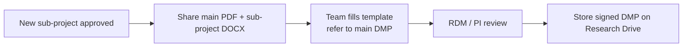

# Data management plan (DMP)

*Maintain the main NMCB DMP and help sub-projects complete aligned sub-project DMPs without duplicating the master document.*

**Related:** [Research Drive](../systems/research-drive.md) (storage and data journey) · [Data architecture](../systems/data-architecture.md) · [Castor](../systems/castor.md) · [myDRE](../systems/mydre.md) · [Keep in mind (GDPR)](../index.md#keep-in-mind-gdpr-and-data-sharing)

---

## Purpose

The **NMCB Data Management Plan (DMP) v2.0** is the **single source of truth** for cohort-wide data governance, storage, access, sharing, and archiving. Sub-projects (e.g. **VIRGIMME**, **MALIBU**, **IDO2 Pathway in Post-COVID**) complete a **shorter template** that **refers to the main DMP** instead of copying it.

| Document | Role |
| -------- | ---- |
| [Main DMP v2.0 (PDF)](../files/data-management-plan/NMCB-Data-Management-Plan-v2.0.pdf) | Official NMCB framework (Amsterdam UMC F01 / SOP 001 RDM) |
| [Sub-project template (DOCX)](../files/data-management-plan/NMCB-DMP-template-sub-projects.docx) | Per new sub-project; fill project-specific sections |
| [Folder README](../files/data-management-plan/README.md) | How the DMP folder is organised and used |

Optional **Training materials** may sit alongside these files on Research Drive (see folder README).

---

## Where the DMP lives

Keep the canonical set on **Research Drive** under the NMCB **data management** area (exact path: document in [Where data lives](../where-data-lives.md) when confirmed). The copies in this hand-over repo are **reference attachments** for the successor; update Research Drive when the PDF or template changes.

| Hand-over copy | Filename in repo |
| -------------- | ---------------- |
| Main DMP | `docs/files/data-management-plan/NMCB-Data-Management-Plan-v2.0.pdf` |
| Sub-project template | `docs/files/data-management-plan/NMCB-DMP-template-sub-projects.docx` |
| Folder guide | `docs/files/data-management-plan/README.md` |

---

## NMCB main DMP — key facts (from v2.0 / template)

Use the PDF for full text. These items are repeated often in sub-project templates as **“See main DMP”**:

| Topic | NMCB default (confirm in PDF) |
| ----- | ----------------------------- |
| **METC** | NL84795.018.23 |
| **Co-ordinating PI** | Jos A. Bosch — [j.a.bosch@uva.nl](mailto:j.a.bosch@uva.nl) |
| **DMP completion / data steward** | Shuxin Zhang — [s.x.zhang@amsterdamumc.nl](mailto:s.x.zhang@amsterdamumc.nl) |
| **RDM consultant** | Meriem Manaï — [m.manai@amsterdamumc.nl](mailto:m.manai@amsterdamumc.nl) |
| **DPO registration (Verwerkingsregister)** | **157135** (separate registration may be needed for omics not in NMCB DB — consult DPO) |
| **Identifiers** | Encoded data with **Subject ID**; subject identification log **separate** from study data |
| **DPIA** | Performed — see main DMP |
| **Central digital documents** | Research Drive + systems named in main DMP (Castor, eLabJournal / codebook, etc.) |
| **eCRF** | **Castor** (training documented; Castor Academy) |
| **Transfer** | SURF FileSender, **myDRE** where appropriate |
| **Publishing / catalogues** | e.g. DataverseNL, Amsterdam Cohort Hub (ACH) — per main DMP phase 4–5 |
| **Archiving** | Digital preservation **20 years**; subject ID log archived separately |

Sub-project templates use Amsterdam UMC **F01 Data management plan v2.0 – RDM** (numbered items aligned with **SOP 001 RDM**).

---

## When a new sub-project starts

### Steps

1. **Share** with the project team:
   - [NMCB Data Management Plan v2.0 (PDF)](../files/data-management-plan/NMCB-Data-Management-Plan-v2.0.pdf)
   - [Sub-project template (DOCX)](../files/data-management-plan/NMCB-DMP-template-sub-projects.docx)
2. **Instruct** the team to:
   - Complete **project-specific** fields (study title, data types table §1.10, devices, reuse from NMCB, etc.)
   - Write **“See main DMP”** (or equivalent) wherever the master plan already covers NMCB policy — **do not duplicate** long sections
3. **Optionally** share relevant items from **Training materials** on Research Drive
4. **Review** with **Meriem Manaï** (RDM) and **PI signature** on the sub-project DMP where required
5. **Archive** the approved sub-project DMP next to the main DMP on Research Drive (version/date in template header)

### Sub-project template phases (checklist)

The DOCX follows the standard Amsterdam UMC phases. For each sub-project, ensure these are addressed (many answers point to the main DMP):

| Phase | Topics |
| ----- | ------ |
| **1 — Study preparation** | Privacy (1.1–1.6), data acquisition table (1.10), storage locations (1.27–1.29), agreements (1.32), Castor / devices as applicable |
| **2 — Data collection** | Delegation log, read-only raw + copy for processing (2.3), secure transfer (2.5), QC (2.6), Castor change control (2.8–2.9), locking (2.10–2.11) |
| **3 — Processing & analysis** | External processing, secure transfer, analysis agreements |
| **4 — Writing & publishing** | Manuscript folders, PIDs, catalogues (DataverseNL, ACH) |
| **5 — Sharing & archiving** | Metadata, reuse consent, DSA, 20-year digital archive, subject ID log separate |

**Reuse from NMCB:** sub-projects often tick reuse of existing NMCB data (§1.11) and refer to informed consent / site-specific ID logs (§1.13, §1.31).

---

## Rules (from DMP folder README)

- The **main DMP** is the only master; when it is updated, sub-project DMPs should stay **aligned** (update references, not orphaned copies).
- **References over duplication** — easier maintenance when RDM policy changes.
- **Sensitive data:** follow main DMP + [Research Drive vs YoDa](../systems/research-drive.md#research-drive-vs-yoda-irods); do not put sensitive data on Research Drive.
- **Data requests:** sub-project exports must still follow [GDPR minimization](../index.md#keep-in-mind-gdpr-and-data-sharing) and [Data request](data-request.md) tooling where applicable.

---

## Contacts

| Role | Contact |
| ---- | ------- |
| **RDM consultant (DMP)** | Meriem Manaï — [m.manai@amsterdamumc.nl](mailto:m.manai@amsterdamumc.nl) |
| **DMP responsible (NMCB)** | Shuxin Zhang — [s.x.zhang@amsterdamumc.nl](mailto:s.x.zhang@amsterdamumc.nl) |
| **Co-ordinating PI** | Jos A. Bosch — [j.a.bosch@uva.nl](mailto:j.a.bosch@uva.nl) |
| **RDM policy / storage** | Paulo Heemskerk — [p.f.heemskerk@amsterdamumc.nl](mailto:p.f.heemskerk@amsterdamumc.nl) |
| **SOP reference** | Amsterdam UMC SOP 001 Research Data Management (iProva / intranet) |

---

## Handover checklist

- [ ] Confirm Research Drive path to live DMP folder + training materials
- [ ] Confirm main DMP version (currently **2.0**) and date on PDF cover
- [ ] List active sub-projects with completed sub-project DMPs (VIRGIMME, MALIBU, IDO2, …)
- [ ] Document whether DPO **157135** covers new data types (e.g. omics) or needs separate registration
- [ ] Keep repo copies of PDF/DOCX in sync when RDM publishes updates
- [ ] Draw or extend the [data journey diagram](../systems/research-drive.md#data-journey-document-this-over-time) for device → Snowflake paths

---

## Related

- [Research Drive](../systems/research-drive.md) — `data management/` folder, versioning, YoDa for sensitive data
- [Data request](data-request.md) — approved extracts after sub-project / cohort requests
- [Sample request](sample-request.md) — biobank releases
- [GitHub](../systems/github.md) — code and reproducibility alongside DMP scripts metadata
- [FAIR projects](../fair/index.md) — Health-RI / EHDS metadata and FDP
