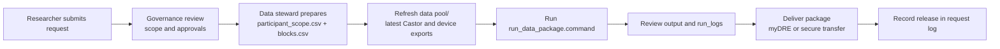
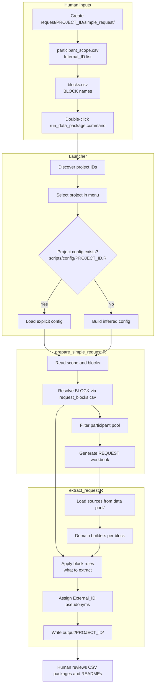

# Data request

**Status:** Complete

This page documents the **data-request** project at [github.com/nmcb-fair/data-request](https://github.com/nmcb-fair/data-request). The repository builds researcher-facing **data packages** (CSV exports with pseudonyms) from Castor, device, and related sources in `data pool/`.

Governance (forms, approvals, delivery policy) is in [Data requests (governance)](../governance/data-requests.md). This page covers **how to run the extraction tooling** after a request is approved.

## Purpose

The project supports approved data requests by:

- selecting participants for a research project ID (e.g. `P008`, `ITN001`)
- extracting agreed **blocks** of data (screening, questionnaires, devices, visit forms, ACS, …)
- writing pseudonymized outputs under `output/<project_id>/` with package-level README files
- keeping a reproducible request manifest and participant roster per run

## Repository layout

| Path | Role |
| ---- | ---- |
| `data pool/` | Newest source exports (Castor, Omron, Nellcor, Tanita, visit, screening, ACS, CRL, …) |
| `request/<project_id>/` | Participant pool, pseudonym mapping, and per-project request inputs |
| `request/<project_id>/simple_request/` | Non-technical inputs: participant list + block list (recommended) |
| `output/<project_id>/` | Deliverable CSV packages and top-level README |
| `output/run_logs/` | Launcher run logs |
| `mapping_table/` | Cumulative `NMCB_<project_id>_pseudonym_mapping.csv` files |
| `scripts/` | Extraction pipeline, block config, project configs |
| `scripts/config/request_blocks.csv` | Central catalog of reusable **BLOCK** definitions |
| `run_data_package.command` | macOS launcher (double-click) |

Detailed operator guide in the repo: `RUN_DATA_PACKAGE.md`. Block authoring: `BLOCKS_GUIDE.md`.

## Workflow diagrams

### End-to-end (governance through delivery)

### Simple request extraction (data-request repo)

**Legend:** **Blocks** (`request_blocks.csv`) define *what* to extract; **domain builders** define *where* source files are read from `data pool/`.

## Simple request flow (recommended)

For most new exports, only two CSV files are needed under `request/<project_id>/simple_request/`:

| File | Required columns | Purpose |
| ---- | ---------------- | ------- |
| `participant_scope.csv` | `Internal_ID` | Which participants to include |
| `blocks.csv` | `BLOCK` (optional `PACKAGE`) | Which data blocks to extract |

**Steps**

1. Copy the template from `request/EXAMPLE/simple_request/` to `request/<project_id>/simple_request/`.
2. Fill `participant_scope.csv` with Castor/internal IDs.
3. Fill `blocks.csv` with block names from the catalog below (one block per row).
4. Place the newest source files in `data pool/` (see project config for expected folders).
5. Double-click `run_data_package.command` and choose the project ID.
6. The launcher runs `prepare_simple_request.R`, then `extract_request.R`, and writes outputs to `output/<project_id>/`.

**Automatic behaviour**

- Project IDs are discovered from `simple_request/` folders (except `EXAMPLE`).
- Participant pool and request workbook are generated or filtered from the block list.
- Backups go to `request/<project_id>/simple_request/backups/`.
- IDs not found in the pool are listed in `missing_participant_ids.csv`.

Add `scripts/config/<project_id>.R` only when you need custom paths, hooks, or non-standard domains (template: `scripts/config/PROJECT_CONFIG_TEMPLATE.R`).

## Request blocks (what to extract)

Blocks define **what** to query. Defaults live in `scripts/config/request_blocks.csv`. In `blocks.csv`, list the `BLOCK` name only; leave source columns empty unless overriding a row.

| BLOCK | Source domain | Section / notes |
| ----- | ------------- | ----------------- |
| Screening | `screening` | ME/CFS, Post-COVID, Lyme screeners (separate CSVs) |
| DSQ-2 | `dsq_2` | Variables matching `dsq_*` |
| Questionnaires | `vragenlijsten` | All questionnaire forms |
| Blood Pressure | `omron` | Omron measurements |
| Oximetry | `nellcor` | Nellcor measurements |
| Anthropometric Measure | `tanita` | Tanita measurements |
| NASA Lean Test | `visit` | Form: NASA Lean Test |
| Handgrip | `visit` | Form: Handknijpkracht |
| Beighton Score | `visit` | Form: Beighton Score |
| Protocol Deviation | `visit` | Form: Protocol Afwijkingen |
| Bell Score | `vragenlijsten` | Variables matching `Bells_*` |
| ACS | `acs` | Amsterdam Cognitive Scan exports |

Validate block definitions: `Rscript scripts/validate_request_blocks.R`

## Configured project IDs

Registry in `scripts/config/project_registry.R` (launcher also picks up new IDs from `simple_request/` folders):

| Project ID | Style |
| ---------- | ----- |
| `ITN001` | Manifest-driven |
| `P001` | Package outputs (+ validation workbook hooks) |
| `P003` | Package outputs |
| `P004` | Manifest-driven |
| `P007` | Manifest-driven |
| `P008` | Manifest-driven |

Each project may filter participants (e.g. exclude healthy controls) and attach project-specific hooks via `scripts/config/<project_id>.R`.

## Outputs

Typical deliverable structure under `output/<project_id>/`:

- `01_participants.csv` — roster for the request
- `01_request_manifest.csv` — machine-readable copy of the request specification
- `<package>/` folders — one per block/package (e.g. `screening/`, `blood_pressure/`, `oximetry/`)
  - `01_participants.csv` + domain CSV(s) per package
  - package `README.md` (see `README_STYLE_STANDARD.md` in the repo)
- `README.md` — top-level package overview

**Linking key:** `External_ID` across files. Mapping file: `mapping_table/NMCB_<project_id>_pseudonym_mapping.csv` (stable pseudonyms for new internal IDs).

## Software requirements

- **R** with `Rscript` on PATH
- **Pandoc** (if rendering depends on rmarkdown in your environment)
- R packages required by the extraction scripts (install in the project R environment used for NMCB tooling)
- macOS: use `run_data_package.command`; on Windows/Linux, run the equivalent `Rscript` steps from `RUN_DATA_PACKAGE.md`

## If something fails

1. Open the latest log in `output/run_logs/`.
2. Check for missing or misnamed files under `data pool/` or `request/`.
3. Confirm participant IDs exist in the project participant pool.
4. For block errors, verify names against `request_blocks.csv` and project `source_domains` in config.

## Legacy workflow

Older projects may still use explicit participant-pool files and request workbooks under `request/<project_id>/` without `simple_request/`. The same launcher runs `extract_request.R`; if `simple_request/` is absent, existing pool/request files are used unchanged.

## Handover checklist

- [ ] Confirm who may edit `simple_request/` CSVs vs `scripts/config/`
- [ ] Confirm process for refreshing `data pool/` before each run
- [ ] Confirm delivery channel per request ([myDRE](../systems/mydre.md) vs file transfer)
- [ ] Keep request log and approvals in governance docs, not only in git output folders

## Related

- [Data requests (governance)](../governance/data-requests.md) — forms, review, and policy
- [Sample request](sample-request.md) — biobank sample releases (separate repo)
- [myDRE](../systems/mydre.md) — secure analysis environment for some deliveries
- [Snowflake](../systems/snowflake.md) — structured data and extracts
- [Scripts and QC](../systems/scripts-and-qc.md) — upstream cleaning before data pool
