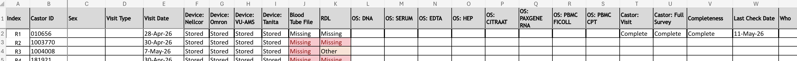

# Recurring study routines

Operational tasks that keep NMCB running day to day: tracking visits and raw data collection, maintaining identifiers, and producing summary counts. These are not full end-to-end pipelines (see [Workflows](index.md) for CDL, devices, sample requests, etc.) but they feed those pipelines.

| Routine                                                   | Typical cadence                        | Primary output                                 |
| --------------------------------------------------------- | -------------------------------------- | ---------------------------------------------- |
| [Regular visit data log](#regular-visit-data-log)         | Weekly (confirm with team)             | Per-participant raw data collection status     |
| [Checklist for data routine](#checklist-for-data-routine) | Bi-weekly; before each data request    | QC sign-off that raw/processed data are usable |
| [Regular subject ID log](#regular-subject-id-log)         | Bi-weekly; when new participants enrol | Consistent IDs across systems                  |
| [Get numbers](#get-numbers)                               | Weekly/bi-weekly or on request         | Board tables and funnel plots                  |

Complete locations and owners in [Where data lives](../where-data-lives.md). Formal SOPs live in the project Research Drive / team documentation (not duplicated here).

---

## Regular visit data log

### Purpose

Track, per participant and visit, whether expected **raw data sources** were collected (devices, lab files, questionnaires, etc.). This log is the operational source of truth for “what still needs to be uploaded or fixed” after a visit.

It supports:

- follow-up with nurses and assistants on missing uploads  
- [CDL](cdl-alert-workflow.md) and [RDL](rdl-alert-workflow.md) processing (visit linkage)  
- [Device data workflow](device-data-workflow.md) QC cadence

### Frequency

- **Weekly** during active visit periods (recommended minimum)  
- **After each visit batch** when recruitment or scheduling is heavy  
- Confirm exact weekday and owner with the study coordinator (currently `TBD` in [Where data lives](../where-data-lives.md))

### Inputs

- completed visits for the period 
- current visit data log (previous version)  
- knowledge of which modalities apply per visit type (clinic vs home)  
- access to Research Drive folders where raw files should appear (see [Research Drive](../systems/research-drive.md))

### Steps

1. Create a backup of the current version and move it to **archive** folder with a date in the filename (e.g. `visit_data_log__YYYYMMDD.xlsx`).before making changes.
2. For each participant row, record at minimum:
  - participant ID (Castor / study ID; max 7 characters — see Quality checks below)  
  - visit date (optional: and visit type (clinic / home))
  - per data source: stored or not, depending on the file setup.
3. Compare against the previous log; flag **new** completions and **new** gaps.
4. Cross-check high-impact sources:
  - device exports (Omron, Tanita, Nellcor, VU-AMS, ACS as applicable)  
  - lab-related handoffs where this participant should appear in CDL/RDL paths
5. Assign follow-ups (upload, re-export, ID correction) and note due dates outside the inbox only.

### Example layout

Use a stable column set so the log can be compared week to week.

### Outputs

- Updated visit data log (Excel or agreed format)  
- Short list of participants with missing raw data and assigned owners

### Quality checks

- Completed visits appear in the log with visit date and type filled.  
- Incomplete or rescheduled visits are visibly flagged, not left blank.  
- Participant IDs are **at most 7 characters** and match Castor / subject ID log.  
- Each expected modality for that visit type has a clear collected / pending / N/A value.  
- Downstream tasks (device QC, CDL/RDL folders) can be derived from the log without re-asking coordinators.

### Related

- [Device data workflow](device-data-workflow.md) — where raw device files should land  
- [RDL alert workflow](rdl-alert-workflow.md) — uses `Radboud Visit Data Log` for linkage  
- [Get numbers](#get-numbers) — visit **counts** from LDOT overview; this log tracks **raw file collection**

---

## Checklist for data routine

### Purpose

Confirm that raw, processed, and transformed data are **available, complete, and safe to use** before merging, reporting, or fulfilling a [data request](../tasks/data-request.md). This is a structured QC pass, not a substitute for pipeline-specific workflows.

### Frequency

- **Bi-weekly** during active data collection  
- **Always before** starting work on a formal data request or large extract  
- After any known outage, export failure, or Castor/LDOT schema change

### Systems

- [Research Drive](../systems/research-drive.md) — raw and processed folders  
- [Snowflake](../systems/snowflake.md) — structured counts and tables (when in use)  
- [GitHub](../systems/github.md) — cleaning and validation scripts in `nmcb-fair` repos

### Steps

1. **Scope** — List which sources are in scope for this run (e.g. devices, CDL, Castor exports, LDOT, Snowflake tables).
2. **Raw layer** — For each source folder, check:
  - files exist for the expected date range  
  - file size is plausible (see table below)  
  - naming convention matches SOP / device workflow
3. **Row counts** — Where possible, compare:
  - number of participants or visits in raw exports  
  - number of rows in processed files or Snowflake tables for the same slice  
  - large mismatches → stop and investigate before using data downstream
4. **Identifiers** — Spot-check participant IDs:
  - length ≤ 7 characters  
  - no obvious duplicates or placeholder values  
  - alignment with [subject ID log](#regular-subject-id-log) and Castor
5. **Processed / transformed** — Confirm processed outputs exist for raw inputs you expect to be merged (dated subfolders, no empty “latest” only).
6. **Sign-off** — Record date, checker name, sources checked, and any exceptions in a short log (email or checklist file).

### File size and sanity checks

| Check             | Rule of thumb                                                                                                                                 | If failed                                   |
| ----------------- | --------------------------------------------------------------------------------------------------------------------------------------------- | ------------------------------------------- |
| Empty file        | **0 B** is incorrect                                                                                                                          | Re-export or restore from backup            |
| VU-AMS export     | ~**200 MB** per file can be normal; multiple or huge files may indicate abnormal export (see [Device data workflow](device-data-workflow.md)) | Escalate per device QC                      |
| Delimited exports | Opens with expected row count in Excel/R                                                                                                      | Wrong delimiter or incomplete export        |
| Participant ID    | **Max length 7**                                                                                                                              | Fix in Castor / subject ID log before merge |

### Potential automation (future)

- Automated row-count comparison: raw export vs Snowflake table for the same source and date  
- Scripted file-size and naming checks (document in relevant repo README or [Devices](../systems/devices.md))

Document any script used in the sign-off note.

### Outputs

- Completed checklist (dated)  
- List of blocked sources with owner and target fix date

### Quality checks

- No source marked “OK” without a spot-check or count comparison.  
- Exceptions are explicit (what was skipped and why).  
- Data request work does not start while critical sources are red on the checklist.

---

## Regular subject ID log

### Purpose

Keep **participant identifiers** consistent and traceable across operational and analytical systems (Castor, LDOT, device exports, lab files, Snowflake, sample tracking). The log is especially important for participants who have **completed a visit**, where PII and study ID must map correctly (see the Subject ID Log SOP on Research Drive).

### Frequency

- **Bi-weekly**  
- **Whenever new participants are registered** or IDs are corrected  
- After any reported duplicate-ID or merge issue (document resolution in the team issue log)

### Inputs

- current subject ID log  
- [CRL admin](cdl-alert-workflow.md) or equivalent admin files where Castor IDs and **patient type** are maintained  

### Steps

1. Create a backup of the current version before making any changes. Move the backup to the `archive` folder and include the date in the filename, e.g. `Subject_ID_Log_YYYYMMDD.xlsx`.
2. Identify participants who have been added since the last log update.
3. For each new participant, assign or verify the study ID according to the agreed convention. Do not create ad hoc ID formats.
4. Record the mapping fields needed for joins, such as Castor ID, email, phone number, and name. Access to PII should be restricted to authorised roles only.
5. Check for duplicates (e.g. the same person with two IDs) and gaps (e.g. missing ID for an active participant). This should be detected automatically by Excel validation, but please also check manually.
6. For participants who have completed a visit, confirm that the same ID appears in dependent systems by spot-checking Castor, one device folder, and one lab path.

### Outputs

- Updated subject ID log  
- Short note on any ID changes or merges applied

### Quality checks

- No duplicate active IDs for the same participant.  
- No accidental gaps in the sequence (unless explained by study design).  
- Mapping consistent across visit log, Castor, and device/lab outputs used that week.  
- PII stored only where access is controlled (SOP target audience: authorised assistants or data manager).

### Related

- [Checklist for data routine](#checklist-for-data-routine) — ID length and duplicate checks  
- [Get numbers](#get-numbers) — uses `CRL_admin.xlsx` for type/sex/age alignment in overview exports

---

## Get numbers

**Task page:** [NMCB numbers overview](../tasks/number-overview.md) — full run instructions, inputs, and outputs.

### Purpose

Produce standard NMCB recruitment and visit-progress counts for board updates, operational reports, and ad hoc questions (registered, screener sent/completed, waiting for call/video/visit, visit done, losses).

For routine NMCB reporting, use the **`nmcb-overview`** repository rather than ad hoc Snowflake or Castor queries.

### Frequency

- Weekly or bi-weekly during active recruitment (typical board rhythm)
- On demand when stakeholders ask for updated funnel or visit counts
- Always after fresh LDOT/screener exports are available

### Primary system

- GitHub repository: `nmcb-fair/nmcb-overview`
- Local entry point: `run_all.R` (runs overview build, then numbers/plots)
- User-facing run instructions: `USER_GUIDE.Rmd` in that repository

Related references:

- [Device data workflow](device-data-workflow.md) · [GitHub](../systems/github.md)
- [Castor](../systems/castor.md) (source system for screeners; counts are derived via LDOT overview pipeline)
- [Snowflake](../systems/snowflake.md) (use only for non-standard metrics not covered by `nmcb-overview`)

### Prerequisites (data refresh)

Before running, place the latest exports in `nmcb-overview/data/`:

- `data/LDOT/` — latest LDOT participant and event exports (Amsterdam UMC, NMCB, Radboud)
- `data/Screening/` — latest screener CSV exports (ME/CFS, Post-COVID, Lyme, legacy Castor screener if applicable)
- `data/postcode/` — postcode radius reference files (`50km-pc4.csv`, AMC/Radboud radius files)
- `data/CRL Admin/` — `CRL_admin.xlsx` (used to align participant type, sex, age, and deduplication)

If any folder is stale, output numbers will reflect old data even if the script runs successfully.

### Steps

1. Confirm the reporting date (default: today). To re-run a previous date:
  - set `NMCB_RUN_DATE=YYYYMMDD` before sourcing `run_all.R`.
2. Open the project in RStudio (`Overview.Rproj`) from the `nmcb-overview` folder.
3. Restore dependencies once per machine if needed: `renv::restore()`.
4. Run `run_all.R` (Source).
  - Step 1 builds participant overview: `ldot_overview.Rmd`
  - Step 2 generates summary tables/plots: `scripts/get_numbers.R`
5. Collect outputs and share in the agreed format (usually Excel + PDF slides).
6. Record run date and input file versions used (for reproducibility).

### Outputs

Main outputs are written under `export/`:

- Participant-level dataset:
  - `export/overview_participants/NMCB_Participants_LDOT__YYYYMMDD.xlsx`
- Numbers and figures (dated subfolder):
  - `export/numbers_and_figures/YYYYMMDD/overview_tables__YYYYMMDD.xlsx`
  - `export/numbers_and_figures/YYYYMMDD/participant_flow_after_screener__YYYYMMDD.pdf`
  - `export/numbers_and_figures/YYYYMMDD/participant_funnel_pe_participant_type.pdf__YYYYMMDD.pdf`
  - `export/numbers_and_figures/YYYYMMDD/geo_by_type_no_screener__YYYYMMDD.pdf`
  - `export/numbers_and_figures/YYYYMMDD/visit_sex_by_type__YYYYMMDD.pdf`
  - `export/numbers_and_figures/YYYYMMDD/visit_dsq_by_type__YYYYMMDD.pdf`

### Which table answers which question

In `overview_tables__YYYYMMDD.xlsx`:

| Sheet / table             | Use when asked about                                                                                                              |
| ------------------------- | --------------------------------------------------------------------------------------------------------------------------------- |
| `overview_table`          | Overall funnel by participant type (`pt_type`): registered, screener sent/completed, waiting stages, visit done/scheduled, losses |
| `geo_by_type_no_screener` | Registered participants without screener yet, split by distance to AMC/Radboud                                                    |
| `visit_sex_by_type`       | Sex distribution among participants with visit done                                                                               |
| `visit_dsq_by_type`       | DSQ criteria counts (CDC/CCC/IOM) among participants with visit done                                                              |

### Quality checks

- Compare `overview_table` totals to the previous run; large unexpected jumps usually indicate export or deduplication issues.
- Confirm today’s (or requested) date appears in output filenames.
- Spot-check a few known participants in `NMCB_Participants_LDOT__YYYYMMDD.xlsx` (ID, `pt_type`, `visit_status`, loss flags).
- Verify screener and LDOT files in `data/` were updated before the run.
- If script fails on missing columns, re-export source files with expected templates (see `USER_GUIDE.Rmd`).

### When not to use this routine

Use a different method (Snowflake query, Castor export, manual count) only when:

- the requested metric is not implemented in `nmcb-overview`, or
- a one-off historical slice is needed outside current export files.

Document the alternative method in the report footnote.